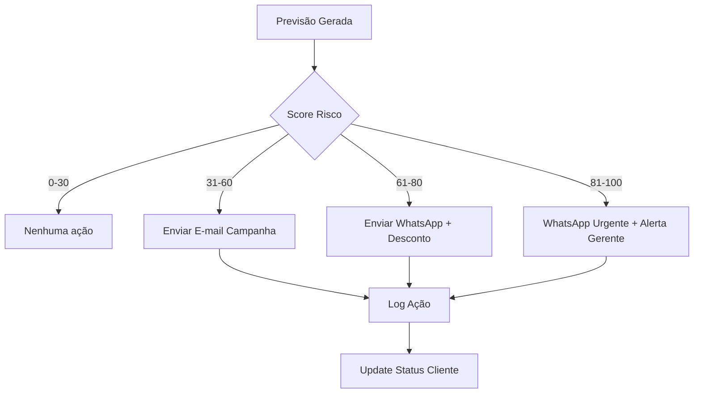

# Design: Sistema de Predição de Evasão de Clientes - Barbearia VIP

**Data:** 2026-05-07  
**Autor:** Claude Opus 4.7  
**Status:** Aprovado para implementação

---

## 1. Visão Geral

Sistema de previsão de evasão (churn) de clientes utilizando MiroFish como microservice independente, integrado à Barbearia VIP Suite. O sistema analisa comportamento de clientes, prevê risco de churn e automatiza ações de retenção.

### 1.1 Objetivos
- Predizer probabilidade de evasão de clientes da Barbearia VIP
- Detectar múltiplos sinais combinados: inatividade, redução de frequência, baixo valor de compra
- Automatizar ações de retenção baseadas no nível de risco
- Integrar com sistema existente sem modificações intrusivas

### 1.2 Escopo
- **Incluído:** Análise de clientes `BarbershopCliente` e `BarbershopVenda`
- **Excluído:** Clientes de outras unidades (LinkFood, VIP Data, etc.)

---

## 2. Arquitetura

```
┌─────────────────────────────────────────────────────────────────────┐
│              Barbearia VIP (Next.js App)                            │
│  ┌────────────────────┐  ┌────────────────────┐                    │
│  │ BarbershopCliente  │  │ BarbershopVenda    │                    │
│  │ - visitas          │  │ - frequência       │                    │
│  │ - perfil           │  │ - valor            │                    │
│  │ - tags             │  │ - última visita    │                    │
│  └────────────────────┘  └────────────────────┘                    │
│                              │                                      │
│                              │ HTTP API                             │
│                              ▼                                      │
│                  ┌─────────────────────────┐                        │
│                  │ /api/churn/predict      │                        │
│                  │ /api/churn/trigger      │                        │
│                  │ /api/churn/stats        │                        │
│                  └─────────────────────────┘                        │
└─────────────────────────────────────────────────────────────────────┘
                              │ HTTP Webhook/Poll
                              ▼
┌─────────────────────────────────────────────────────────────────────┐
│                    MiroFish (Microservice)                          │
│  ┌──────────────────────────────────────────────────────────────┐  │
│  │  Data Connector (MySQL) → Feature Builder → ML Model         │  │
│  │          │              │                    │                │  │
│  │          ▼              ▼                    ▼                │  │
│  │  ┌──────────────┐  ┌──────────────┐  ┌─────────────────┐    │  │
│  │  │ MySQL Read   │  │ Features     │  │ Churn Prediction│    │  │
│  │  │ Pool/Queue   │  │ Calculator   │  │ XGBoost/RF      │    │  │
│  │  └──────────────┘  └──────────────┘  └─────────────────┘    │  │
│  │                                │                              │  │
│  │                                ▼                              │  │
│  │                      ┌───────────────────────┐               │  │
│  │                      │ Action Engine         │               │  │
│  │                      │ - SMS/WhatsApp/E-mail │               │  │
│  │                      │ - Descontos           │               │  │
│  │                      │ - Alertas             │               │  │
│  │                      └───────────────────────┘               │  │
│  │                                │                              │  │
│  │                                ▼                              │  │
│  │                      ┌───────────────────────┐               │  │
│  │                      │ Action Log            │               │  │
│  │                      │ - Historico acoes     │               │  │
│  │                      └───────────────────────┘               │  │
│  └──────────────────────────────────────────────────────────────┘  │
└─────────────────────────────────────────────────────────────────────┘
```

---

## 3. Componentes do MiroFish

| Componente | Responsabilidade | Tecnologias |
|------------|------------------|-------------|
| **Data Connector** | Conexão MySQL, coleta de dados | `mysql2`, `mariadb` |
| **Feature Builder** | Cálculo de features de churn | `pandas`, `numpy` |
| **Churn Model** | Predição de risco | `xgboost`, `scikit-learn`, `joblib` |
| **Action Engine** | Execução de ações automatizadas | `node-fetch`, `axios` |
| **Scheduler** | Agendamento de processamento diário | `node-cron`, `bullmq` |
| **API Server** | Webhook endpoint para Barbearia VIP | `express`, `fastify` |

---

## 4. Features para Predição

### 4.1 Features de Comportamento

| Feature | Descrição | Fórmula/Tipos |
|---------|-----------|---------------|
| `dias_ultima_visita` | Tempo desde última compra | `hoje - ultimaVisita` |
| `frequencia_mensal` | Média de compras por mês | `total_vendas / 3` (últimos 3 meses) |
| `ticket_medio` | Valor médio por compra | `soma_valores / count_vendas` |
| `variabilidade_frequencia` | Coeficiente de variação | `std(frequencias) / media(frequencias)` |
| `tendencia_declinio` | Mudança de frequência | `frequencia_ultimo_mes / frequencia_3meses_ago` |

### 4.2 Features de Valor

| Feature | Descrição |
|---------|-----------|
| `valor_total_comprado` | Soma de todos os valores |
| `valor_ultimo_mes` | Compras nos últimos 30 dias |
| `reducao_valor` | `%` de queda vs 3 meses anteriores |

### 4.3 Features de Perfil

| Feature | Descrição |
|---------|-----------|
| `idade_cadastro` | Tempo desde cadastro |
| `tag_outras_lojas` | Possível cliente de outras barbearias |
| `origem_app` | Clientes via app têm menor churn |

---

## 5. Classes de Risco

| Status | Score | Probabilidade | Ações Automáticas |
|--------|-------|---------------|-------------------|
| **Baixo** | 0-30 | < 30% | Nenhuma |
| **Médio** | 31-60 | 30-60% | E-mail/SMS campanha, Alerta interno |
| **Alto** | 61-80 | 60-80% | WhatsApp + Desconto oferta, Alerta interno |
| **Crítico** | 81-100 | > 80% | WhatsApp + E-mail + Alerta gerente, Oferta especial |

---

## 6. Estrutura de Dados

### 6.1 Tabelas Existentes (Barbearia VIP)

```sql
-- barbershop_clientes (já existe)
-- barbershop_vendas (já existe)
```

### 6.2 Tabelas Novas (MiroFish)

```sql
-- Tabela de previsões
CREATE TABLE churn_predictions (
  id INT PRIMARY KEY AUTO_INCREMENT,
  cliente_id INT NOT NULL,
  unidade_id INT NOT NULL,
  score_risco TINYINT UNSIGNED NOT NULL,  -- 0-100
  probabilidade FLOAT NOT NULL,           -- 0.0-1.0
  features JSON,                          -- Features calculadas
  previsao_data DATETIME NOT NULL,
  proxima_visita_prevista DATE,
  status ENUM('ativo', 'em_risco', 'em_risco_alto', 'perdido'),
  created_at DATETIME DEFAULT NOW(),
  updated_at DATETIME DEFAULT NOW() ON UPDATE CURRENT_TIMESTAMP,
  INDEX idx_cliente (cliente_id),
  INDEX idx_previsao (previsao_data),
  INDEX idx_status (status)
);

-- Tabela de ações
CREATE TABLE churn_acoes (
  id INT PRIMARY KEY AUTO_INCREMENT,
  cliente_id INT NOT NULL,
  unidade_id INT NOT NULL,
  tipo_acao ENUM('email', 'sms', 'whatsapp', 'desconto', 'alerta') NOT NULL,
  mensagem TEXT,
  status ENUM('pendente', 'enviado', 'falhou', 'ignorado', 'respondeu') DEFAULT 'pendente',
  data_acao DATETIME,
  response_data JSON,
  created_at DATETIME DEFAULT NOW(),
  INDEX idx_cliente (cliente_id),
  INDEX idx_status (status),
  INDEX idx_data (data_acao)
);

-- Tabela de logs
CREATE TABLE churn_logs (
  id INT PRIMARY KEY AUTO_INCREMENT,
  tipo_processamento ENUM('diario', 'manual', 'agendado') NOT NULL,
  registros_analisados INT,
  previsoes_geradas INT,
  acoes_disparadas INT,
  status ENUM('success', 'error'),
  erro_mensagem TEXT,
  duration_ms INT,
  created_at DATETIME DEFAULT NOW()
);
```

---

## 7. Integração com Barbearia VIP

### 7.1 Endpoints da API

| Endpoint | Método | Descrição |
|----------|--------|-----------|
| `GET /api/churn/predict?unidadeId=1` | GET | Retorna previsões de churn |
| `GET /api/churn/predict/cliente/:id` | GET | Previsão específica de cliente |
| `POST /api/churn/trigger` | POST | Dispara processamento manual |
| `GET /api/churn/stats` | GET | Estatísticas gerais |
| `GET /api/churn/dashboard` | GET | Dados para dashboard |
| `POST /api/churn/acoes/config` | POST | Configura ações automáticas |
| `POST /api/churn/acoes/test` | POST | Testa envio de mensagem |

### 7.2 Payload de Requisição/Resposta

**GET /api/churn/predict**
```json
// Response
{
  "data": [
    {
      "cliente_id": 123,
      "nome": "João Silva",
      "telefone": "11999999999",
      "score_risco": 75,
      "probabilidade": 0.75,
      "status": "em_risco_alto",
      "features": {
        "dias_ultima_visita": 45,
        "frequencia_mensal": 0.5,
        "ticket_medio": 85.5
      },
      "ultima_visita": "2026-03-23",
      "ultimo_valor": 120.00
    }
  ],
  "total": 150,
  "em_risco": 45,
  "em_risco_alto": 12
}
```

**POST /api/churn/trigger**
```json
// Request
{
  "unidadeId": 1,
  "forceReprocess": false
}

// Response
{
  "success": true,
  "processamento_id": 45,
  "registros_analisados": 150,
  "previsoes_geradas": 150
}
```

---

## 8. Fluxo de Trabalho

### 8.1 Processamento Diário (Scheduler)

```
00:00 → Connect MySQL
         ↓
00:01 → Query BarbershopCliente WHERE ativo=1
         ↓
00:02 → Query BarbershopVenda (últimos 90 dias)
         ↓
00:03 → Feature Builder (calcula features)
         ↓
00:04 → Churn Model (predição)
         ↓
00:05 → Action Engine (aplica regras de ação)
         ↓
00:06 → Save predictions + actions + logs
```

### 8.2 Ações Automáticas



---

## 9. Configurações

### 9.1 Variáveis de Ambiente (MiroFish)

```env
# MySQL Connection
MYSQL_HOST=localhost
MYSQL_PORT=3306
MYSQL_USER=barbearia_user
MYSQL_PASSWORD=secret
MYSQL_DATABASE=barbearia_vip

# Model Settings
MODEL_PATH=/data/models/churn_model_v1.joblib
FEATURE_COLUMNS=[...]

# Action Settings
ACTION_ENABLED=true
ACTIONS_EMAIL_ENABLED=true
ACTIONS_SMS_ENABLED=false
ACTIONS_WHATSAPP_ENABLED=true
ACTIONS_DISCOUNT_ENABLED=true

# WhatsApp API (se aplicável)
WHATSAPP_API_TOKEN=xxx
WHATSAPP_PHONE_ID=xxx

# Email (SMTP)
SMTP_HOST=smtp.gmail.com
SMTP_PORT=587
SMTP_USER=churn@barbearia.com
SMTP_FROM=no-reply@barbearia.com

# Scheduling
SCHEDULE_CRON="0 0 * * *"  # Daily at 00:00
```

### 9.2 Configurações de Ação (Tabela `churn_acoes_config`)

```sql
CREATE TABLE churn_acoes_config (
  id INT PRIMARY KEY AUTO_INCREMENT,
  unidade_id INT,
  tipo_acao ENUM('email', 'sms', 'whatsapp', 'desconto', 'alerta'),
  ativo BOOLEAN DEFAULT TRUE,
  mensagem_template TEXT,
  score_min INT DEFAULT 0,
  score_max INT DEFAULT 100,
  criado_em DATETIME DEFAULT NOW()
);
```

---

## 10. Testes

### 10.1 Testes Unitários

| Arquivo | Testes |
|---------|--------|
| `src/features.test.ts` | Cálculo de features |
| `src/model.test.ts` | Predição com dados mockados |
| `src/actions.test.ts` | Envio de mensagens (mockado) |

### 10.2 Testes de Integração

- Conexão MySQL real
- Pipeline completo: dados → features → previsão → ação
- Retorno de webhook do Barbearia VIP

### 10.3 Métricas de Avaliação

| Métrica | Objetivo |
|---------|----------|
| AUC-ROC | > 0.80 |
| Precisão (Precision) | > 0.70 |
| Revocação (Recall) | > 0.60 |
| F1-Score | > 0.65 |

---

## 11. Deployment

### 11.1 Infraestrutura

| Ambiente | Configuração |
|----------|--------------|
| Desenvolvimento | Docker Compose local |
| Staging | AWS ECS / Heroku |
| Produção | AWS ECS / DigitalOcean App Platform |

### 11.2 CI/CD

```yaml
# .github/workflows/deploy.yml
name: Deploy MiroFish

on:
  push:
    branches: [main]

jobs:
  deploy:
    runs-on: ubuntu-latest
    steps:
      - uses: actions/checkout@v3
      - name: Build Docker image
        run: docker build -t mirofish:latest .
      - name: Push to registry
        run: docker push mirofish:latest
      - name: Deploy to ECS
        run: aws ecs update-service ...
```

---

## 12. Roadmap de Implementação

| Fase | Itens | Tempo Estimado |
|------|-------|----------------|
| **Fase 1** | MySQL connector, Feature builder, API básica | 3-4 dias |
| **Fase 2** | Model training (com dados reais), Predição | 3-4 dias |
| **Fase 3** | Action engine (email/whatsapp), Logging | 2-3 dias |
| **Fase 4** | Scheduler, Integration com Barbearia VIP | 2 dias |
| **Fase 5** | Tests, Documentation, Deployment | 2 dias |

**Total:** ~2 semanas para MVP funcional

---

## 13. Próximos Passos

1. ✅ Escrever documento de design (feito)
2. ✅ Aprovar design com stakeholders
3. **Próximo:** Criar plano de implementação detalhado
4. **Próximo:** Setup do repositório do MiroFish
5. **Próximo:** Implementação fase 1

---

## Anexos

### A. Referências
- [XGBoost Documentation](https://xgboost.readthedocs.io/)
- [Scikit-learn User Guide](https://scikit-learn.org/stable/user_guide.html)
- [MySQL Node.js Connector](https://www.npmjs.com/package/mysql2)

### B. Glossário
- **Churn:** Evasão de clientes
- **Feature:** Atributo calculado para predição
- **Score Risco:** Valor 0-100 indicando probabilidade de churn
